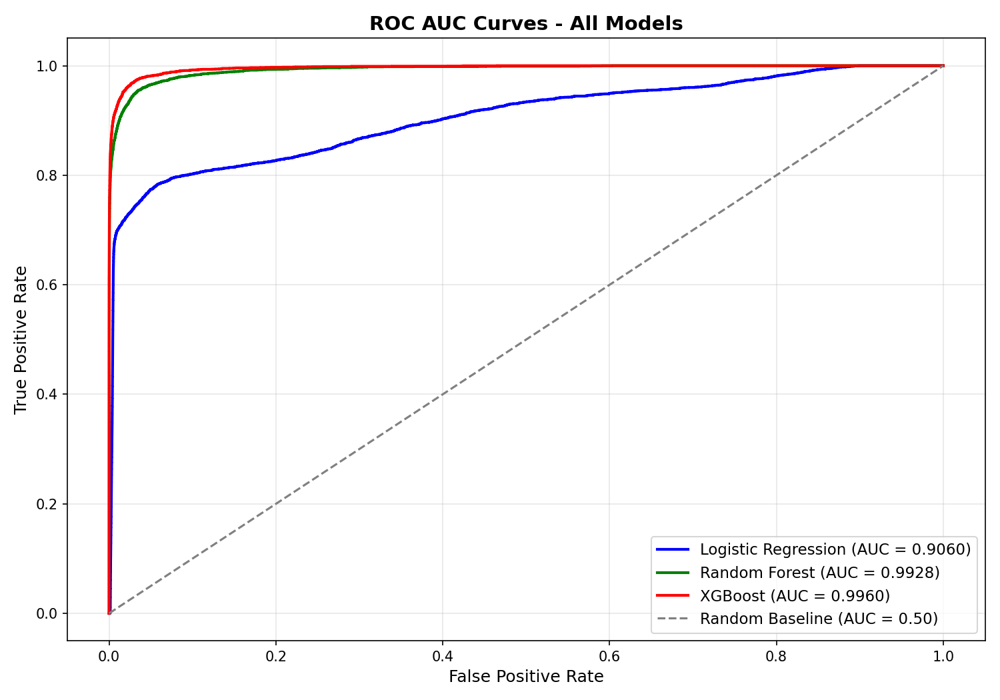
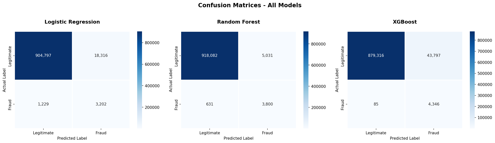
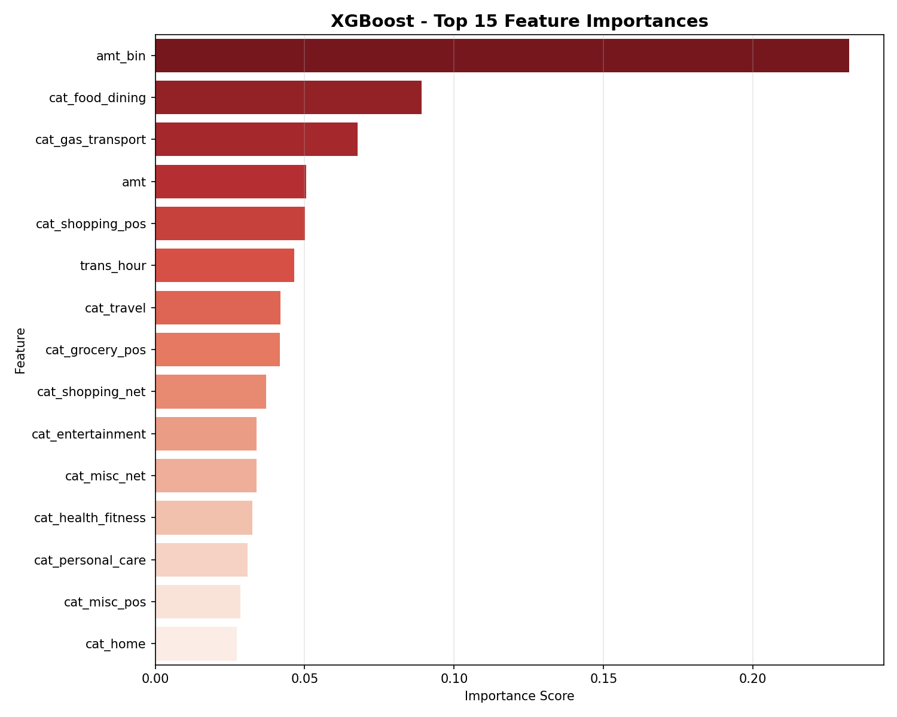
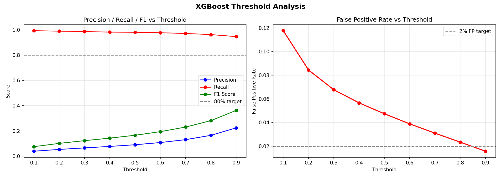
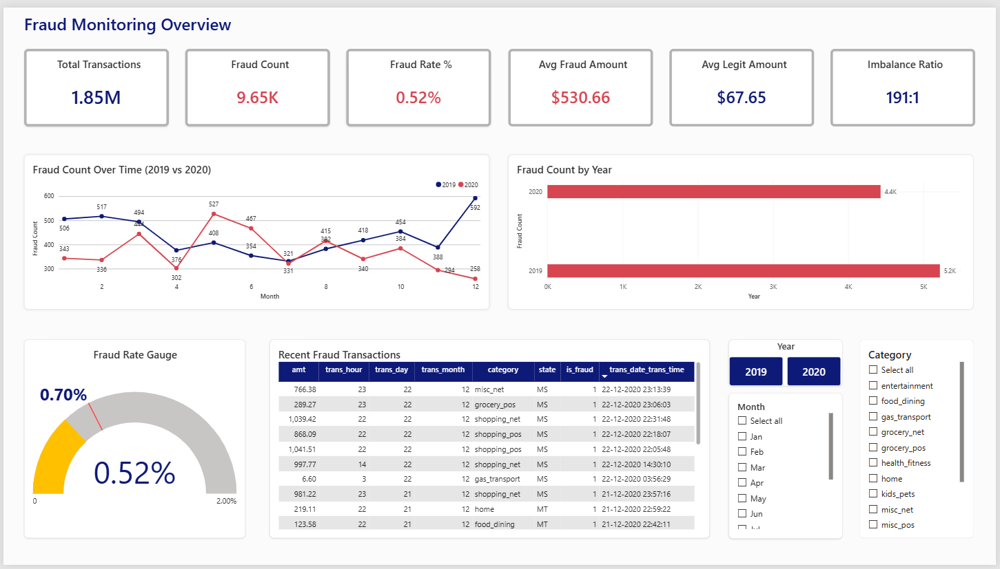
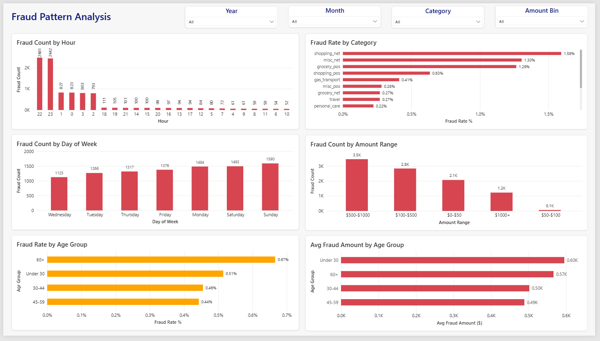
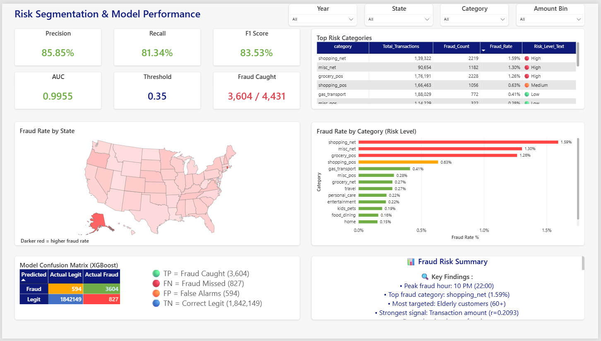

# 💳 Credit Card Fraud Detection & Risk Dashboard

---

## 📌 Project Overview
An end-to-end **Credit Card Fraud Detection** project built using
**1.85 million real-world transactions** from 2019-2020.
The project covers complete data science pipeline from
**Exploratory Data Analysis** to **Machine Learning Modeling**
to an **Interactive Power BI Dashboard**.

---

## 📊 Dataset Information
| Property | Value |
|----------|-------|
| Total Transactions | 1,852,394 |
| Fraud Transactions | 9,651 (0.52%) |
| Legit Transactions | 1,842,743 (99.48%) |
| Imbalance Ratio | 191:1 |
| Period | 2019 - 2020 |
| Source | Kaggle - Credit Card Fraud Dataset |

> ⚠️ Dataset files are too large for GitHub.
> Download from: [Kaggle Dataset Link](https://www.kaggle.com/)

---

## 🗂️ Project Structure

credit-card-fraud-detection/
│
├── 📁 data/
│ ├── creditcard_clean.csv ← Cleaned dataset (not uploaded)
│ ├── fraudTest.csv ← Raw test data (not uploaded)
│ └── fraudTrain.csv ← Raw train data (not uploaded)
│
├── 📁 notebooks/
│ ├── 01_eda.ipynb ← Phase 1: Exploratory Data Analysis
│ └── 02_modeling.ipynb ← Phase 2: Machine Learning Model
│
├── 📁 models/
│ ├── model.pkl ← Trained XGBoost model
│ ├── features.pkl ← Selected features
│ ├── scaler.pkl ← Data scaler
│ ├── threshold.pkl ← Optimal threshold (0.35)
│ └── model_config.txt ← Model configuration
│
├── 📁 images/
│ ├── 📁 eda_plots/ ← Phase 1 EDA visualizations
│ ├── 📁 model_plots/ ← Phase 2 Model visualizations
│ └── 📁 dashboard_screenshots/ ← Phase 3 Dashboard screenshots
│
├── 📁 dashboard/
│ └── Credit_Fraud_Detection.pbix ← Power BI file (not uploaded)
│
├── 📁 reports/
│ └── data_quality_report.txt ← Data quality report
│
├── .gitignore
└── README.md

---

## 🔍 Phase 1: Exploratory Data Analysis

### Key Findings:
| Finding | Detail |
|---------|--------|
| Strongest Signal | Transaction Amount (r=0.2093) |
| Peak Fraud Hour | 10 PM (22:00) |
| Top Fraud Category | shopping_net (1.59%) |
| Most Targeted | Elderly customers (60+) |
| Lowest Fraud Month | December |
| Fraud Avg Amount | Higher than legitimate |
| Gender Difference | Slight difference M vs F |
| Distance Signal | Weak signal |

### EDA Visualizations:
| Plot | Description |
|------|-------------|
| A1 | Class Distribution |
| A2 | Fraud Pie Chart |
| A3 | Fraud Rate by Category |
| A4 | Transaction Volume by Category |
| B1 | Amount Distribution |
| B2 | Boxplot by Class |
| B3 | Fraud Rate by Amount |
| C1 | Transaction Volume Over Time |
| C2 | Fraud Rate by Hour |
| C3 | Fraud Rate by Day |
| C4 | Fraud Rate by Month |
| C5 | Fraud Heatmap Hour vs Day |
| D1 | Top States Fraud Count |
| D2 | Fraud Rate by State |
| D3 | Distance Analysis |
| E1 | Fraud Rate by Gender |
| E2 | Age Distribution |
| E3 | Fraud Rate by Age Group |
| E4 | Fraud Rate by Job |
| F1 | Top Merchants Fraud Count |
| G2 | Feature Correlation |

---

## 🤖 Phase 2: Machine Learning Model

### Models Tested:
| Model | AUC | F1 Score | Selected |
|-------|-----|----------|----------|
| Logistic Regression | - | - | ❌ |
| Random Forest | - | - | ❌ |
| XGBoost | 0.9955 | 83.53% | ✅ |

### Final Model Results (XGBoost):
| Metric | Value |
|--------|-------|
| Precision | 85.85% |
| Recall | 81.34% |
| F1 Score | 83.53% |
| AUC | 0.9955 |
| Threshold | 0.35 |
| Fraud Caught | 3,604 / 4,431 |
| Fraud Missed | 827 |
| False Alarms | 594 |

### Confusion Matrix:
| | Actual Fraud | Actual Legit |
|--|--|--|
| **Predicted Fraud** | 3,604 ✅ | 594 ⚠️ |
| **Predicted Legit** | 827 ❌ | 1,842,149 ✅ |

### Top Features:
1. amt → Transaction amount
2. trans_hour → Time of transaction
3. shopping_net → Online shopping category
4. gas_transport → Gas station category
5. misc_net → Misc online category
6. grocery_pos → Grocery category
7. travel → Travel category
8. food_dining → Food & dining category

### Model Visualizations:

---

## 📈 Phase 3: Power BI Dashboard

### Tab 1: Fraud Monitoring Overview

**Visuals:**
- 6 KPI Cards (Total Transactions, Fraud Count,
  Fraud Rate, Avg Fraud Amount, Avg Legit Amount,
  Imbalance Ratio)
- Gauge Chart (Fraud Rate 0.52%)
- Recent Frauds Table (Top 20)
- Line Chart (2019 vs 2020 trend)
- Bar Chart (Fraud by Year)
- Slicers (Year, Month, Category)

---

### Tab 2: Fraud Pattern Analysis

**Visuals:**
- Fraud Count by Hour (Peak at 10 PM)
- Fraud Rate by Category (shopping_net highest)
- Fraud Count by Day of Week
- Fraud Count by Amount Range
- Fraud Rate by Age Group
- Avg Fraud Amount by Age Group
- Slicers (Year, Month, Category, Amount Bin)

---

### Tab 3: Risk Segmentation

**Visuals:**
- Model Performance KPI Cards (6)
- Fraud Rate by Category (Risk Coded)
- US State Map (Fraud by State)
- Confusion Matrix (XGBoost)
- Top Risk Categories Table
- Insight Text Panel
- Slicers (Year, State, Category, Amount Bin)

---

## 🛠️ Tech Stack
| Technology | Purpose |
|------------|---------|
| Python 3.8+ | Data processing and modeling |
| Pandas | Data manipulation |
| NumPy | Numerical computation |
| Scikit-learn | Machine learning |
| XGBoost | Fraud detection model |
| Matplotlib | Data visualization |
| Seaborn | Statistical visualization |
| Power BI | Interactive dashboard |
| Git & GitHub | Version control |

---

## 📌 Key Insights
→ Peak fraud hour : 10 PM (22:00)
→ Top fraud category : shopping_net (1.59%)
→ Most targeted : Elderly customers (60+)
→ Strongest signal : Transaction amount (r=0.2093)
→ Best model : XGBoost (AUC=0.9955)
→ Fraud caught : 81.34% of all frauds

---

## ✅ Recommendations
1. Flag transactions above threshold 0.35 for review
2. Increase monitoring during 10 PM - 12 AM
3. Extra verification for elderly customers (60+)
4. Priority monitoring for online shopping category
5. Review all high-amount transactions ($500+)
6. Focus resources on top 4 high-risk categories

---

## 🚀 How to Run

## 1. Clone the repository

git clone https://github.com/yourusername/credit-card-fraud-detection.git
cd credit-card-fraud-detection

## 2. Install dependencies

pip install pandas numpy scikit-learn xgboost matplotlib seaborn jupyter

## 3. Download the dataset

Download from Kaggle and place in data/ folder:

creditcard_clean.csv
fraudTrain.csv
fraudTest.csv

## 4. Run EDA notebook

jupyter notebook notebooks/01_eda.ipynb

## 5. Run Modeling notebook

jupyter notebook notebooks/02_modeling.ipynb

## 6. Open Power BI Dashboard

Download Credit_Fraud_Detection.pbix
Open with Power BI Desktop